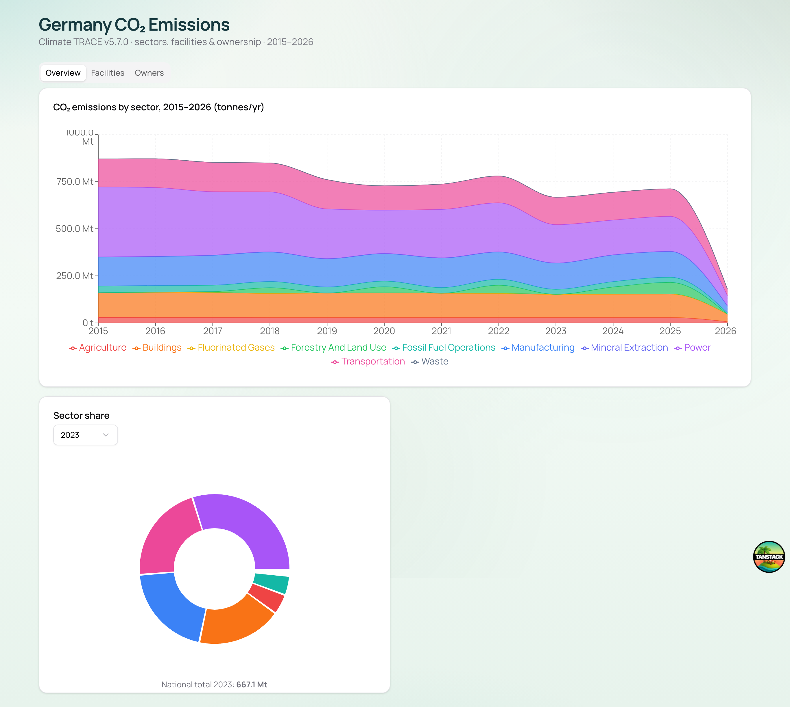
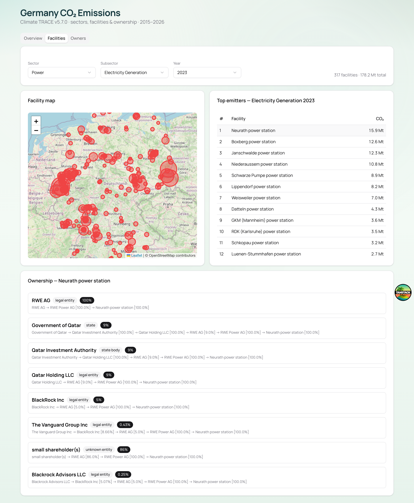
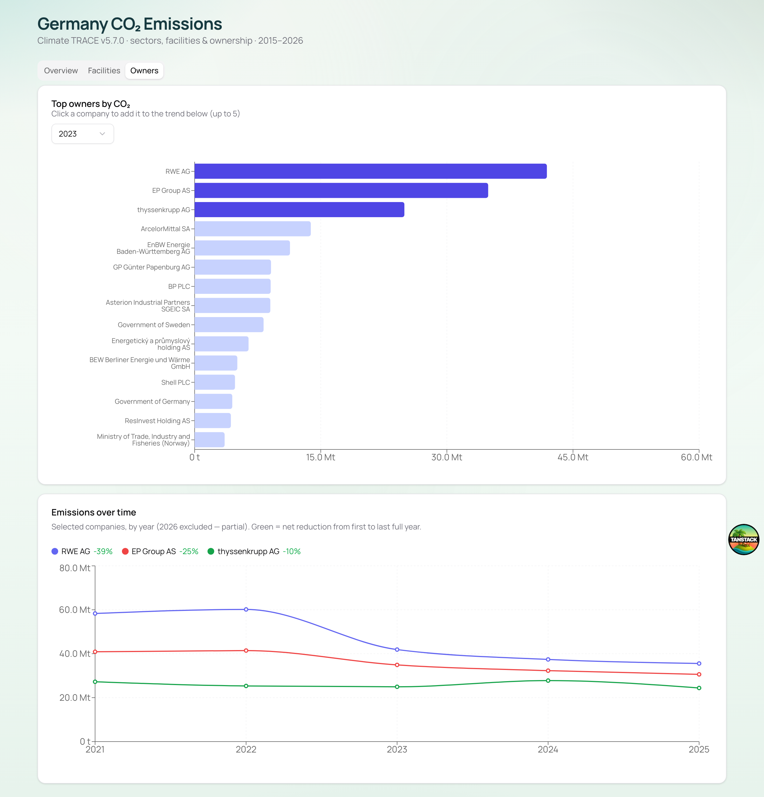
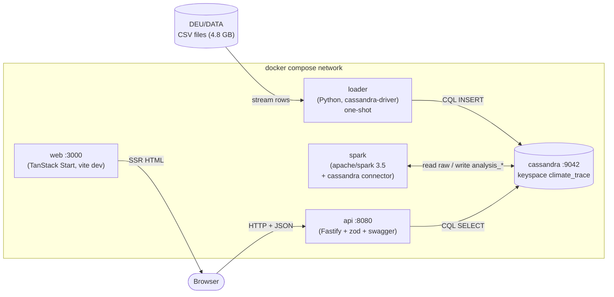
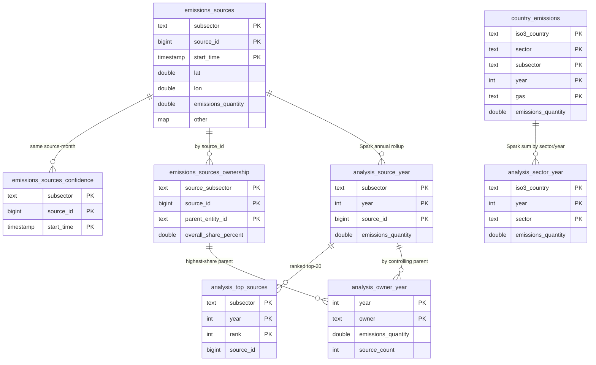
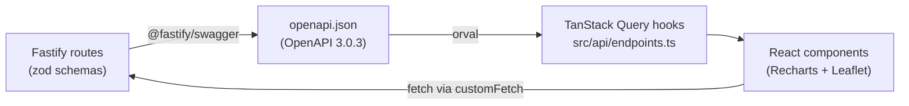

# German CO₂ Emissions Pipeline (Climate TRACE v5.7.0)

Cassandra + Spark + Node/OpenAPI API + (TanStack Start) React, all via Docker.

## Dashboard

**Overview** — CO₂ emissions by sector over time, plus a selectable year's
sector share:



**Facilities** — sector / subsector / year pickers driving a facility bubble
map, a top-emitters table, and a corporate-ownership drill-down (here: Neurath
power station → RWE, with its Qatari and BlackRock shareholders):



**Owners** — CO₂ attributed to each facility's controlling parent company,
ranked for a selectable year (RWE, EP Group/LEAG, thyssenkrupp, …). Click any
company to chart its emissions over time and see who actually reduced (green =
net cut; 2026 excluded as a partial year):



## Architecture

### System / deployment

Five Docker services on one network. The browser is served by `web` (SSR) and
fetches data directly from the `api`; the heavy ingest and analytics happen
out-of-band against Cassandra.



### Data model & flow

Tables are query-driven (partition keys match read patterns). The loader fills
the raw tables; Spark rolls them up into the `analysis_*` tables the API serves.



### Frontend type-safety flow

The API is the single source of the contract: its OpenAPI doc generates the
client the React app uses, so types flow end-to-end.



## Data

Climate TRACE v5.7.0, Germany (DEU), **CO₂ only**, 2015–2026. 10 sectors / ~45
subsectors, 4.8 GB. Four CSV types per subsector: country totals (annual),
facility sources (monthly), confidence, ownership.

> **The raw CSVs are not in this repo** (4.8 GB, with a single 2.3 GB file —
> far over GitHub's 100 MB/file limit). Only the small `DEU/ABOUT_THE_DATA/`
> docs are tracked. To run the pipeline, download the Germany dataset from
> [Climate TRACE](https://climatetrace.org/data) and place it so the CSVs live
> under `DEU/DATA/<sector>/…` (matching `DEU/ABOUT_THE_DATA/`).

## Prerequisites

Docker + Docker Compose. The `DEU/` data folder in the repo root.

## Steps

### 1. Start Cassandra
```bash
docker compose up -d cassandra        # wait until healthy (~60s)
docker inspect --format '{{.State.Health.Status}}' co2-cassandra
```

### 2. Load the data
```bash
docker compose build loader
# Apply schema + load the small annual country tables:
docker compose run --rm loader python load.py --apply-schema --types country_emissions
# Load everything else (facility sources ~4.5M rows, confidence, ownership):
docker compose run --rm loader python load.py --types ownership,emissions_sources,confidence
# Tip: limit to one sector/subsector with --filter, e.g. --filter power/
```

### 3. Run the Spark analysis
A **Kotlin** job (`spark/kotlin/`, native Spark Java API) populates
`analysis_sector_year`, `analysis_source_year`, `analysis_top_sources`, and
`analysis_owner_year` (CO₂ by controlling parent company).
First compile it to a jar (one-shot Gradle build), then submit:
```bash
# build spark/kotlin/build/libs/analysis.jar
docker compose run --rm spark-build

# submit it
docker compose run --rm --entrypoint "" spark /opt/spark/bin/spark-submit \
  --packages com.datastax.spark:spark-cassandra-connector_2.12:3.5.1 \
  --conf spark.jars.ivy=/tmp/.ivy --class co2.AnalysisKt /jars/analysis.jar
```
> Built with Kotlin → JVM 11 bytecode (the `apache/spark:3.5.3` image runs
> Java 11). Spark itself is `compileOnly`; only our code + kotlin-stdlib are in
> the jar, and the Cassandra connector comes via `--packages`.

### 4. Start the API
```bash
docker compose up -d --build api
curl localhost:8080/sectors
# OpenAPI docs: http://localhost:8080/docs   (JSON at /docs/json)
```

### 5. Regenerate the OpenAPI spec (for Orval)
```bash
curl -s localhost:8080/docs/json | python3 -m json.tool > api/openapi.json
cp api/openapi.json web/openapi.json     # the web build regenerates its client from this
```

### 6. Start the React app (TanStack Start)
```bash
docker compose up -d --build web
open http://localhost:3000
```
The image runs Orval (`npm run gen`) at build time to generate a TanStack Query
client from `web/openapi.json` and installs deps. **The container runs the Vite
dev server (`npm run dev`) with HMR** — `web/` is bind-mounted, so edits on the
host hot-reload live (the image's Linux `node_modules` is preserved via an
anonymous volume; `VITE_USE_POLLING=1` makes file-watching work across the
Docker bind mount). The browser calls the API at `http://localhost:8080`
(override with `VITE_API_URL`).

> The Leaflet map is loaded as a **client-only lazy import** (Leaflet touches
> `window` at import time and must not be evaluated during SSR).
>
> For a production build instead of dev mode, drop the `command`/`volumes`
> overrides on the `web` service and use `CMD node .output/server/index.mjs`.

Frontend stack: TanStack Start + TanStack Query (Orval-generated hooks) +
shadcn/ui + Recharts (sector time-series & breakdown) + React-Leaflet (facility
map). Two tabs: **Overview** (stacked area + donut) and **Facilities**
(sector/subsector/year pickers → bubble map + top-emitters table + corporate
ownership drill-down).

## API endpoints

| Method/path | Purpose |
|---|---|
| `GET /sectors` | list of sectors |
| `GET /sectors/timeseries` | CO₂ per sector per year (stacked time-series) |
| `GET /sectors/{sector}/subsectors` | subsector-year rows for one sector (breakdown) |
| `GET /subsectors/{subsector}/top?year=` | top-20 emitting facilities |
| `GET /subsectors/{subsector}/sources?year=` | all facility points (map) |
| `GET /subsectors/{subsector}/sources/{sourceId}/ownership` | corporate ownership |

## Notes

- Bitnami Docker images were removed from Docker Hub in 2025; we use the
  official `apache/spark:3.5.3` image.
- Cassandra is query-driven: table partition keys match the read patterns above.
